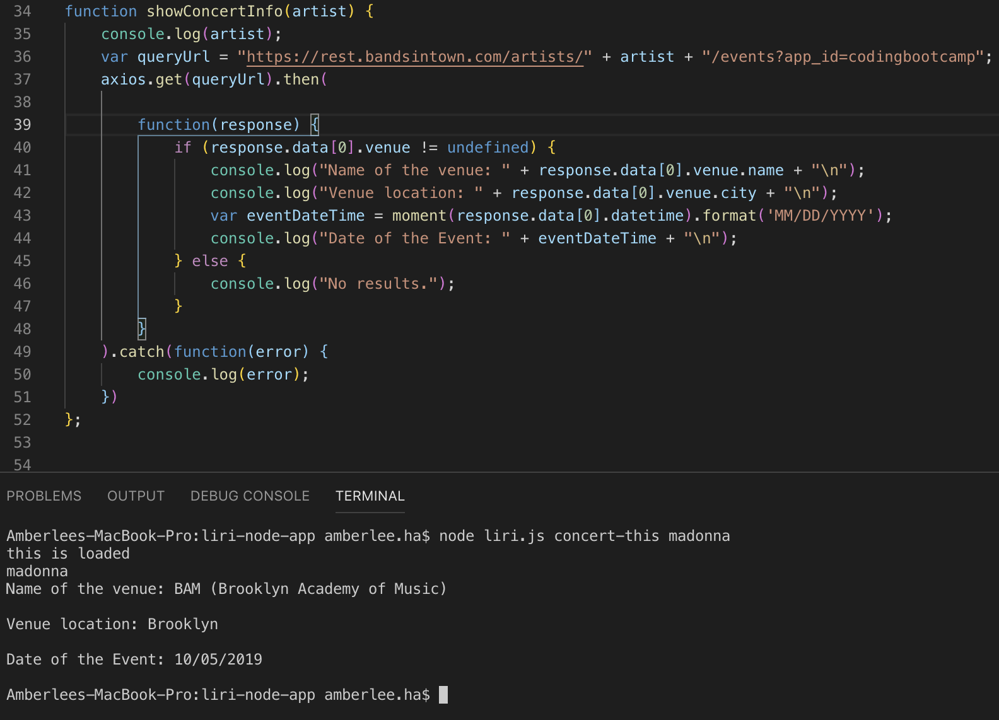
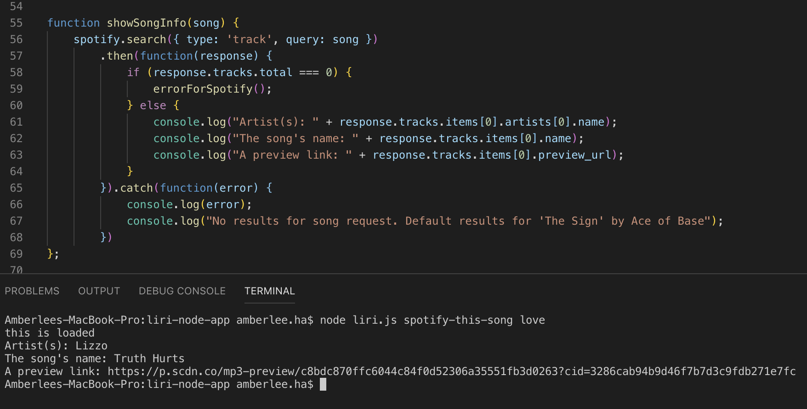
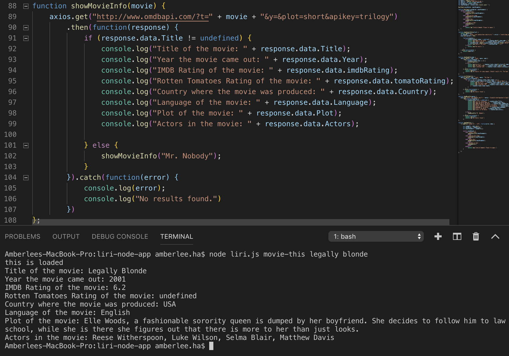
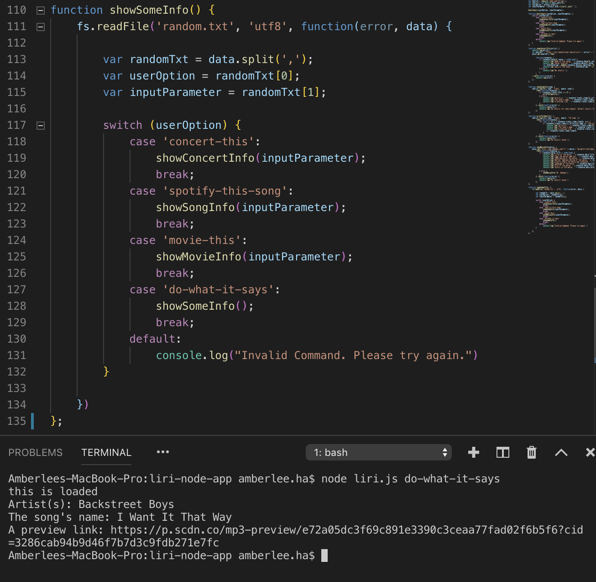

# liri-node-app

Liri is a Language Interpretation and Recognition Interface. Liri will be a command line node app that takes in parameters and gives you back data.

**Setup**
- clone the repo
- run npm install with the following packages:
    - 'Node-Spotify-API'
    - 'Axios' for IMDB and BandsInTown API data
    - 'Moment'
    - 'DotEnv' 
- create a .env file in the same directory, in that file have the following:
    - '# Spotify API keys'
    - 'SPOTIFY_ID=your-spotify-ID-here'
    - 'SPOTIFY_SECRET=your-spotify-secret-here'

**Overview:**
- liri.js can take in one of the following commands: 
    - concert-this
    - spotify-this-song
    - movie-this
    - do-what-it-says

- Each command line should do the following:

- node liri.js concert-this <artist/band name here>

- This will search the Bands in Town Artist Events API ("https://rest.bandsintown.com/artists/" + artist + "/events?app_id=codingbootcamp") for an artist and render the following information about each event to the terminal:
    - Name of the venue
    - Venue location
    - Date of the Event (use moment to format this as "MM/DD/YYYY")

- node liri.js spotify-this-song <song name here>

- This will utilize the node-spotify-api package in order to retrieve song information from the Spotify API.

- This will show the following information about the song in the terminal/bash window

    - Artist(s)
    - The song's name
    - A preview link of the song from Spotify
    - The album that the song is from

- If no song is provided then the program will default to "The Sign" by Ace of Base.

- node liri.js movie-this <movie name here>

- This will use the axios package to retrieve data from the OMDB API.

- This will output the following information to the terminal/bash window:

    - Title of the movie.
    - Year the movie came out.
    - IMDB Rating of the movie.
    - Rotten Tomatoes Rating of the movie.
    - Country where the movie was produced.
    - Language of the movie.
    - Plot of the movie.
    - Actors in the movie.

- If the user doesn't type a movie in, the program will output data for the movie 'Mr. Nobody.'

- node liri.js do-what-it-says

- Using the fs Node package, LIRI will take the text inside of random.txt and then use it to call one of LIRI's commands.

- This will run spotify-this-song for "I Want it That Way," as follows the text in random.txt.

Technologies used-

Node Packages used:
- node-spotify-api
- axios (omdb api, bands in town api)
- moment
- dotenv

**Developer**

-Amberlee Ha